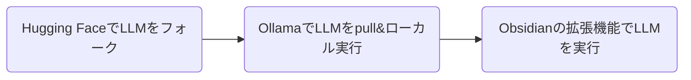
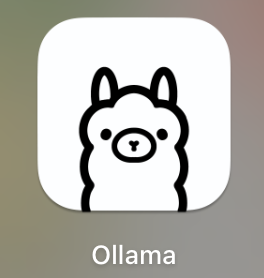

# ObsidianでローカルLLMを使う

Obsidianの拡張機能と[Hugging Face](https://huggingface.co/)[^1]、[Ollama](https://ollama.com/)[^2]を使用してオフライン環境下での生産性の爆上げを図る。  
※自己責任で実施すること。



ちなみに表題に反して、おすすめはGemini APIです。

## 実装環境
M3 Macbook

## Hugging FaceでLLMをフォーク
自分の使いたいLLMがいつ配信停止となっても困らないように、自分のリポジトリにフォークする。  
※ライセンスには注意し、自己責任で行うこと
※Hugging FaceにはOllamaで使えない形式のモデルも存在するため選定の際は注意すること。  
※いつ配信停止となっても別のモデルを探せるのであれば[ObsidianでローカルLMMを使う](#OllamaでLLMをpull&ローカル実行)から実施すること。
### Hugging Face アカウント の作成
Hugging Faceのアカウントはメールアドレスがあれば作れる。有料プランを使用する場合は乗っ取り防止で2FAの設定をしておいた方がいい。  
[Hugging Face – The AI community building the future.](https://huggingface.co/)

### Hugging Face CLI のインストール
Hugging FaceのGUIだと日本語対応しておらず、UIも変更される可能性もあるため、再現性を確保するためCLIをインストールする。  
```bash
brew install huggingface-cli
```

### Access Tokens の作成
Settingsの[Access Tokens]([Hugging Face – The AI community building the future.](https://huggingface.co/settings/tokens))から作成する。Repositories内の項目をチェックする。トークンは発行時にしか表示されないため、メモしておくこと。


### Hugging Face CLI でログイン
先ほど発行したトークンでログインする。
```bash
hf auth login --token <トークン>
```

### Git の大容量ファイル対応
gitが大規模言語モデル等の大容量ファイルを操作できるように`git-lfs`をインストールする。
```bash
brew install git-lfs
git lfs install
```

### LLM のフォーク
フォークといってもGitHubみたいにスマートにはできないため、以下のように行う。（フォーク元のライセンスはあらかじめ確認すること。）
```bash
# リポジトリの作成
hf repo create <フォーク先のリポジトリ>
# ベースモデルのダウンロード（ダウンロード先は標準出力される）
hf download <使いたいLLMリポジトリ>
# ベースモデルをそのまま作成したリポジトリにアップロード
hf upload <フォーク先のリポジトリ> <ベースモデルのダウンロード先>
```

今回は以下2つの日本語学習済みモデルをフォークする。

| モデル                                                           | 用途                    | サイズ     |
| ------------------------------------------------------------- | --------------------- | ------- |
| `elyza/Llama-3-ELYZA-JP-8B-GGUF`                              | 大規模言語モデル（会話生成、質問応答など） | 約4.92GB |
| `lmstudio-community/granite-embedding-278m-multilingual-GGUF` | 文書埋め込みモデル（類似度計算、検索など） | 約972MB  |

```bash
# Llama-3-ELYZA-JP-8B-GGUFのフォーク
hf repo create Llama-3-shindy-jp-8B-GGUF
hf download elyza/Llama-3-ELYZA-JP-8B-GGUF
hf upload shindy-dev/Llama-3-shindy-jp-8B-GGUF <ベースモデルのダウンロード先>

# ruri-largeのフォーク
hf repo create granite-embedding-278m-shindy-multilingual-GGUF
hf download lmstudio-community/granite-embedding-278m-multilingual-GGUF
hf upload shindy-dev/granite-embedding-278m-shindy-multilingual-GGUF <ベースモデルのダウンロード先>
```

自分の作成したリポジトリにモデルがアップロードできたところまで確認できたら、ダウンロードしたLLMは削除する。
```bash
hf cache delete
```

## OllamaでLLMをpull、ローカル実行

### Ollamaのインストール
```bash
brew install --cask ollama
```  

### Ollamaを起動  
一度アイコンから起動しないと`ollama`コマンドが実行できなかった。  


### LLMをpull
```bash
# チャット、ドキュメント作成支援用
ollama pull hf.co/shindy-dev/Llama-3-shindy-jp-8B-GGUF:Q4_K_M

# ドキュメントの類似検索用
ollama pull hf.co/shindy-dev/granite-embedding-278m-shindy-multilingual-GGUF:Q8_0
```
他にpullしたいモデルがあれば以下を雛形としてpullすること。
```bash
ollama pull <モデルのリポジトリURL>
```

## Obsidianの拡張機能でLLMを実行

### Smart Composer
ObsidianでAIとチャットできる拡張機能。チャットを通じて編集中のドキュメントについて執筆をサポートしてくれる。  
公式ドキュメント：[Home · glowingjade/obsidian-smart-composer Wiki](https://github.com/glowingjade/obsidian-smart-composer/wiki)

設定画面で`ollama pull`したモデルを設定する。


[^1]: 作成したAIモデル、データセット、アプリを管理&公開できるGitHubライクなプラットフォーム
[^2]: ローカルでAIモデルを動かすためのプラットフォーム