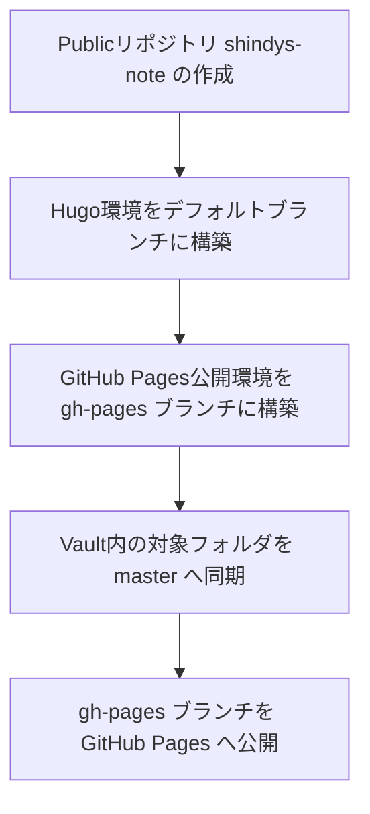

## はじめに
今回はGit管理しているObsidianのVault内ドキュメントの一部を[Hugo](https://gohugo.io/)というSSG（静的サイトジェネレータ）を用いて[GitHub Pages](https://docs.github.com/ja/pages/quickstart)へ無料で自動公開する仕組みを構築してみました🎵


## 対象読者
- Obsidian等でマークダウン記事をGitHubで管理している人向け
- ブログとして公開したい記事がある人向け
- 無料で公開したい人向け
- 書いた記事を自動で公開できるようにしたい人向け
- macOSユーザ向け
  他OSとの違いはHugoのインストール方法程度ですので、他OSユーザーも参考になるかと思います。

## 対応動機
ObsidianのVault（記事を管理しているディレクトリ）はGitHubのPrivateリポジトリで管理しています。以下のディレクトリ構造のように、便宜上技術系ドキュメントと日記をひとつのVaultで管理しているので、技術系ドキュメント（`docs/public`）のみを公開する方法を模索していました。
```text
├── .git/                  # git
├── .obsidian/         # Obsidianの設定
├── diary/               # 日記
├── docs/               # 技術系ドキュメント
│      └public             # 成果物
│      └draft              # 下書き
├── assets/             # 画像や資料アセット（docs用）
├── LICENSE           # リポジトリのライセンスファイル
└── README.md     # リポジトリのREADMEファイル
```
ちなみにObsidianの「ファイルとリンク」の設定は以下のとおりです。ウィキリンクなどObsidian固有の機能はオフにし、画像や資料ファイルは全て`assets`フォルダへ集約しています。

| 設定項目            | 設定値            |
| --------------- | -------------- |
| 新規作成するリンクの形式    | `ファイルに対する相対パス` |
| `[[ウィキリンク]]`を使用 | `OFF`          |
| 新規添付ファイルの作成場所   | `以下で指定されたフォルダ` |
| 添付ファイルフォルダのパス   | `assets`       |

SSGにHugoを選んだ理由は好みのテーマがあったからです。GitHub Pagesが公式でサポートしているJekyllを使用した方が公開手順は減ります。

なお、GitHub PagesにはPrivateリポジトリの対象ディレクトリのみを公開する機能もありますが、Privateリポジリを公開する場合は有料プランに加入していないと利用できなかったため、断念しました🥲


## 今回の方針
Vault内の`docs/public`や`assets`フォルダの内容だけを公開するために、以下の手順を実施します。登場するリポジトリ名やブランチ名は任意の名称をお使いください。

## 使用するもの
- MacBook Air M3
- VS Code ... Hugo設定変更＆デバッグ用途
- Obsidian ... ドキュメントの更新
- [Homebrew](https://brew.sh/ja/) ... パッケージマネージャ（Hugoインストール用）
- Git ... ファイルバージョン管理（`brew install git`でインストール可能）
- GitHubアカウント ... GitHubのサービスをフル活用するので必要
- （任意）Gitクライアント ... GitHub Desktop、VS Codeの拡張機能、SourceTree等使いやすいもの

## 1. Publicリポジトリ`shindys-note` の作成
### Hugoインストール
[macOS](https://gohugo.io/installation/macos/)
```bash
brew install hugo
```
- Windowsユーザーは[こちら](https://gohugo.io/installation/windows/)
- Linuxユーザーは[こちら](https://gohugo.io/installation/linux/)

### Hugo siteの作成 & 空ディレクトリ内に.gitkeepを作成
任意のディレクトリに移動してから以下コマンドを実行してください。
```bash
# Hugo siteの作成
hugo new site shindys-note
cd shindys-note

# 空ディレクトリ内に.gitkeep（中身のないファイル）を作成（空のディレクトリはGitの追跡対象外となるため）
find . -type d -empty -exec touch {}/.gitkeep \;
```
### Gitの初期化
```bash
# デフォルトブランチである`master`や`main`が作成される
git init
```
### （任意）.gitignoreのおすすめ設定
.gitignoreファイルを作成しておくと、中に記述したパスをGitが自動で追跡対象外にしてくれます。
```.gitignore
# Hugo build output
/public/
/resources/_gen/
/hugo_stats.json
/.hugo_build.lock

# Logs and OS files
*.log
.DS_Store
Thumbs.db

# VSCode settings
.vscode/
.history/

# Node stuff (もしnpmでテーマ管理する場合は必要)
node_modules/

# Env files
.env
.env.* 

# Backup files
*~
```

### サイトの基本情報やテーマ変更やローカルでのテスト方法
GitHubへpushする前に、自分の好きなテーマで記事が正しく表示されるかテストしましょう。

#### 基本情報（URLや言語、タイトル等）
hugo.toml内で設定できます。
```toml
# GitHub PagesのURLは通常、以下の形式です
# https://<githubユーザ名>.github.io/リポジトリ名/
baseURL = 'https://shindy-dev.github.io/shindys-note/'

languageCode = 'ja-JP'
title = 'My New Hugo Site'
```

#### テーマ変更
テーマは[Hugo Themes](https://themes.gohugo.io/)に一覧があります。今回は`ananke`に変更する例
```bash
cd shindys-note
git submodule add https://github.com/theNewDynamic/gohugo-theme-ananke.git themes/ananke
# 設定ファイルでテーマを設定すれば完了です
echo 'theme = "ananke"' >> hugo.toml
```

`shindys-note`を再度クローンしたときに、サブモジュールが配置されていない場合はリポジトリ内で以下のコマンドを実行してください。
```bash
git submodule update --init --recursive
```

またサブモジュールを解除（テーマをアンインストール）する場合は以下のコマンドを実行後、変更をコミットしてください。（hugo.tomlのテーマ設定も削除してください。）
```bash
git submodule deinit -f themes/ananke
git rm -f themes/ananke
```
#### post追加
以下のコマンドで`/archetypes/default.md`をテンプレートとして`/content/posts/hello.md`を作成します。あくまでテスト用なので、自分であらかじめ作成したドキュメントを`/content/posts`へ格納してテストしていただいても構いません。テスト用のドキュメントをコミット時に対象とするかは自己判断でお願いします。
```bash
hugo new posts/hello.md
```
#### ローカルサーバー起動
```bash
hugo server -D
```
- `-D` は下書き（draft = trueの記事）も表示するオプションです。  
- 起動後ブラウザで確認 → `http://localhost:1313/<site name>/`
- 保存するたびに自動でリロードしてくれます。


好みのテーマで作成した記事が表示されたら確認は完了です。今回は細かなレイアウトの修正は割愛します。


### `shindys-note`をGitHub へ Publicリポジトリとして公開
GitHubのリモートリポジトリの作成方法は多種多様なので、ご自身に合うやり方で公開してください。
- Gitクライアント（GitHub Desktop等）
- GitHub CLI
- GitHub

.gitignoreの内容にもよりますが、GitHubへは以下の構成がpushされるはずです。
```text
├── .git
├── archetypes
├── content
│      └posts
├── data
├── i18n
├── layouts
├── static
├── themes
├── .gitignore
├── .gitmodules
├── hugo.toml
├── LICENSE
└── README.md
```

## 2. GitHub Pages公開環境を`gh-pages`ブランチに構築
ここでは、GitHub Actionsを使用して`shindys-note`のデフォルトブランチに更新があった際に、自動でHugoによるビルドを行い、成果物を`gh-pages`ブランチへ反映する仕組みを構築します。手順としては以下の内容を記述した`.github/workflows/deploy.yml`を`shindys-note`のデフォルトブランチで作成し、pushするだけです。コメント部分に注意して適宜修正してください。
```yml
name: Deploy Hugo site to GitHub Pages

on:
  push:
    branches:
      - master  # mainの場合はここを書き換える

jobs:
  build-deploy:
    runs-on: ubuntu-latest

    steps:
      - name: Checkout code
        uses: actions/checkout@v3
        with:
          submodules: true # テーマをサブモジュールとして使用している場合

      - name: Setup Hugo
        uses: peaceiris/actions-hugo@v3
        with:
          hugo-version: '0.148.2'  # 好きなHugoバージョンに変更可
          extended: true           # SCSS/SASSをビルドするテーマの場合はtrueにしないとエラーになる
          
      - name: Build Hugo site
        run: hugo --minify

      - name: Deploy to GitHub Pages
        uses: peaceiris/actions-gh-pages@v4
        with:
          github_token: ${{ secrets.GITHUB_TOKEN }}
          publish_dir: ./public
          publish_branch: gh-pages
```

GitHubリポジトリのActionsタブを見ると成否が伺えます。


ここまでで`shindys-note`の環境は整いました。あとはObsidianのVault内の更新があれば`shindys-note`へ同期を行う仕組みを構築し、GitHub Pagesへの公開設定を実施すれば完了です。

## 3. Vault内の対象フォルダを`master`へ同期
Privateリポジトリで管理しているObsidianのVaultの技術系ドキュメント関連ファイルに変更があった場合に、Vault内の対象フォルダ`docs/public`および`assets`フォルダの内容を`shindys-note`の`master`ブランチへ同期（置換）する仕組みを構築します。

### 3.1 Personal Access Token (PAT)の作成
リポジトリ間の操作になりますので、以下の手順でリポジトリ操作権限を持ったPATを作成します。
- GitHub から `Settings > Developer settings > Personal access tokens > Tokens (classic)`
- scope: `repo` にチェックを入れる
- トークンをコピーする
### 3.2 PATをVaultリポジトリに設定
- Vaultリポジトリ → `Settings > Secrets and variables > Actions > New repository secret`
- 名前：`NOTE_REPO_TOKEN`
- 値：上でコピーしたPAT

### 3.3 Vaultリポジトリ内にGitHub Actions用のスクリプトを作成
以下の内容を記述した`.github/workflows/sync-to-note.yml`を作成し、pushしてください。
pushすると、Actionsが動作し、`shindys-note`へ同期が行われます。コメント部分に注意して適宜修正してください。
```yml
name: Sync Vault to shindys-note

on:
  push:
    branches:
      - master   # Vaultのメインブランチに合わせる
    paths:
      - "docs/public/**"
      - "assets/**"

jobs:
  sync:
    runs-on: ubuntu-latest

    steps:
      - name: Checkout Vault repo
        uses: actions/checkout@v3

      - name: Checkout shindys-note repo
        uses: actions/checkout@v3
        with:
          repository: shindy-dev/shindys-note
          path: shindys-note
          token: ${{ secrets.NOTE_REPO_TOKEN }}

      - name: Sync folders
        run: |
          rsync -av --delete docs/public/ shindys-note/content/  # ドキュメントの同期先。テーマによって動機先は変更してください。
          rsync -av --delete assets/ shindys-note/static/assets/  # assetsの同期先。Obsidianの添付ファイル関連の設定によって変更してください

      - name: Commit and push changes
        run: |
          cd shindys-note
          git config user.name "github-actions[bot]"
          git config user.email "41898282+github-actions[bot]@users.noreply.github.com"
          git add .
          git commit -m "Sync from Vault: $(date '+%Y-%m-%d %H:%M:%S')" || echo "No changes to commit"
          git push origin master   # Vaultのメインブランチに合わせる
```

## 4. `gh-pages`ブランチを GitHub Pages へ公開
最後に構築した公開用環境をGitHub Pagesに公開する設定を行います。
1. GitHubリポジトリのSettingsタブのPagesを選択

2. Build and deploymentのSourceに「Deploy from a branch」を選択
3. Branchには`gh-pages`、`/(root)`を設定


ローカルでテストしたときと同じ内容が表示されれば、公開完了です🎵


## おまけ（2025年8月24日追記）
最近は[PaperMod](https://github.com/adityatelange/hugo-PaperMod)というテーマを使っています。見た目はシンプルでスタイリッシュなのが特徴的なテーマです。ざっと見たところ、Hugoのテーマの中で最も人気があるようでした👌  


基本設定は設定ファイル（`hugo.toml`など）で完結し、比較的簡単に利用できるため、私もおすすめします🥰  
私の設定は以下で公開中です。  
[shindys-note/hugo.toml at master · shindy-dev/shindys-note](https://github.com/shindy-dev/shindys-note/blob/master/hugo.toml)

### Google Analyticsについて
`hugo.toml`には以下のようにGoogle Analytics IDを設定できる箇所があります。
```y
  [params.analytics.google]
    SiteVerificationTag = "$GOOGLE_ANALYTICS_ID"
```
私の場合はIDを公開したくなかったので、以下のように変数として定義し、GitHub ActionsでGitHub Pagesにデプロイする際、Secretsに登録した値で置換するようにしています。`sed`コマンドが置換処理を制御しています。
```yml
      - name: Build Hugo site
        run: |
          sed -i "s/\$GOOGLE_ANALYTICS_ID/${GOOGLE_ANALYTICS_ID}/g" hugo.toml
          hugo --minify
        env:
          GOOGLE_ANALYTICS_ID: ${{ secrets.GOOGLE_ANALYTICS_ID }}
```
[shindys-note/.github/workflows/deploy.yml at master · shindy-dev/shindys-note](https://github.com/shindy-dev/shindys-note/blob/master/.github/workflows/deploy.yml)


***So everyone, enjoy life!***