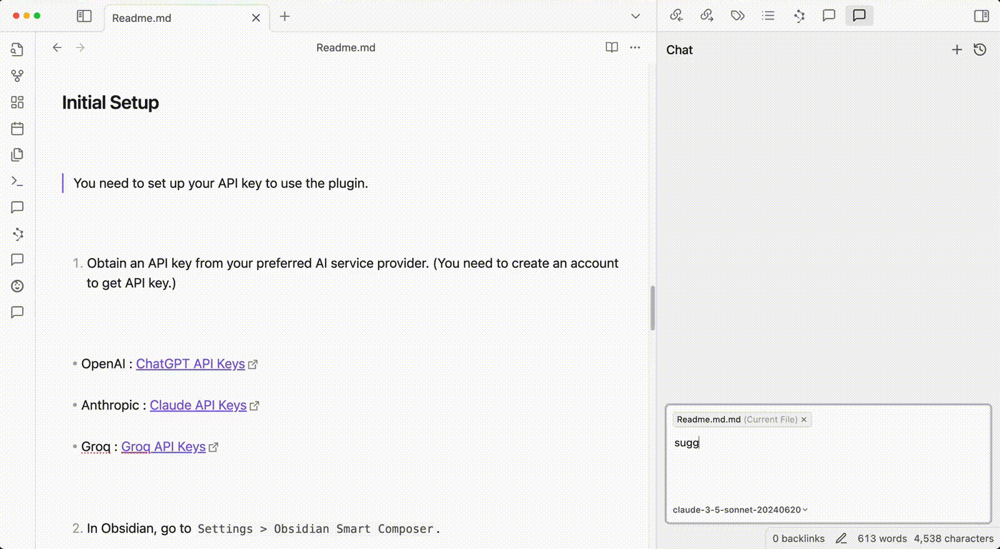

# はじめに
ObsidianでもVS CodeみたいにAI使いたい！って思ってたらインラインチャットはできないけど、チャットできるコミュニティプラグインを見つけたので紹介します。

## Smart Composer
このプラグイン、ただAIと会話できるだけじゃなくて、AIが提案した内容もしっかり反映できるので、執筆時に本当に重宝します🤤

参考：[Home · glowingjade/obsidian-smart-composer Wiki](https://github.com/glowingjade/obsidian-smart-composer/wiki)

チャット入力欄の右下は左から画像添付、通常のチャット開始、Voultチャット開始（Vault全体を参照して回答してくれます。）、になります。左下で登録したモデルが選べます。別途Ollamaというツールが必要ですが、*ローカルLLM*も利用できます。

## 設定紹介
私が使ってる無料のAPIの設定を紹介します。

### Chat用モデル
Chatモデルには無料の中では高性能で1日250リクエストまで実行可能な`gemini-2.5-flash`、ApplyモデルにはChatモデルが処理結果を反映させるだけなのでそこまで性能は求めなくても良いと思い、`gemini-2.5-flash-lite`を設定しています。System promptはChat開始時にバックグラウンドで事前に指示できる設定になります。私は今のところ多用してないのでリクエスト上限は気になってません。

Geminiのリクエスト上限は以下から確認できます。

[レート制限  |  Gemini API  |  Google AI for Developers](https://ai.google.dev/gemini-api/docs/rate-limits?hl=ja)

### RAG
「Retrieval-Augmented Generation（情報検索強化生成）」の略で、自分の学習データからだけでなく、外部の情報（Vault）も検索して回答してくれるモデルです。Vaultチャット利用時に使います。私の場合は`gemini-embedding-001`を「Add custom model」から追加して設定しています。

***So everyone, enjoy life!***