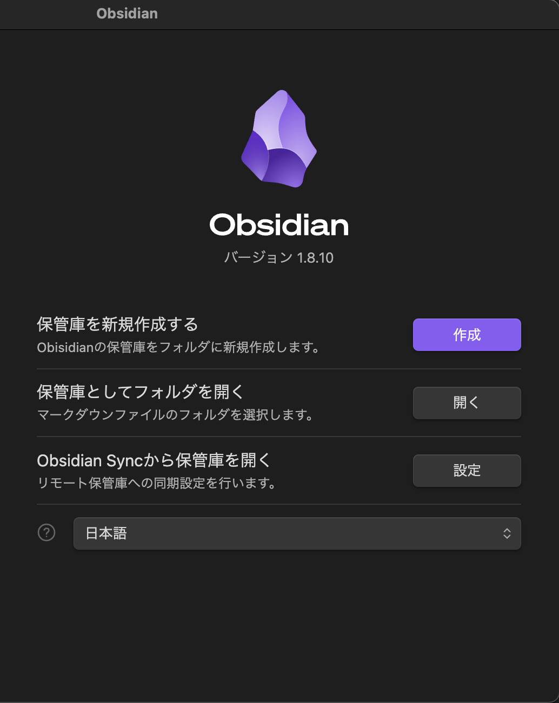
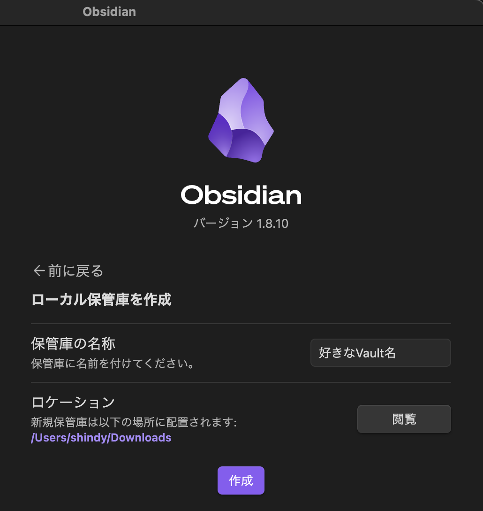
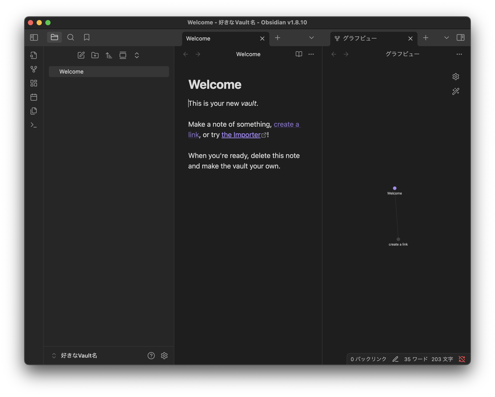

[Obsidian]: https://obsidian.md/

## はじめに
最近Obsidianで日記だったり技術系のドキュメントを執筆していて、今後もこのツールにお世話になりそうなので構築方法をメモとして残します。以降、採用理由等の記載により前置きが長いため、具体的な手順だけ確認したい場合は[こちら](#構築手順)へお進みください。
## [Obsidian][Obsidian]って何
ひとこと で言うと、「Markdownベースのノート管理ツール」。そのほかの特徴は以下のとおり。とにかく便利。
- ノートは通常、ローカルに保存されるけど、ユーザの好みによってクラウドと同期したり、Git管理等のカスタマイズもできる。
- クロスプラットフォームだから、OSを気にせず使える
- ノートを管理するフォルダのようなもの（保管庫）をVaultと読んでいる
- Vault内のノートの関連性を可視化（グラフビュー）できる
- コミュニティプラグイン（有志が作ったプラグイン）がとにかく有能で豊富

## 何でObsidian使ってんの
自分の好きな形式でメモが残せて、マインドマップも使えるから使ってる。具体的には
- Markdownを書くのが楽しいから
  Markdownの記法については[こちら](Markdown記法.md)
- エディタに直接画像を貼り付けられるから
- Canvasで自分の思考を可視化・整理できるから
- UIがシンプルでわかりやすいから
- ローカルファーストで自分のデータを自分で管理できるから（Git管理したかった）
- 会員登録不要で無料で使えるから
- ローカルLLMを動かせるから

他の競合ツールも調査しましたが、`Obsidian`は`VS Code`、`OneNote`、`draw.io`の利点を兼ね備えており、無料で自分の求める機能が全て実現できると判断しました。


## 何の媒体使ってるの
- M3 MacBook ... メイン（執筆、閲覧用途）
- iPad mini 6gen ... サブ（微修正、閲覧用途）
- iPhone 15 ... サブ（閲覧、微修正用途）  

## 構築手順

### Obsidianのインストール
Obsidianの[公式サイト][Obsidian]でインストーラを入手してインストールします。  
brewコマンドもからインストールできます。
```bash
brew install --cask obsidian 
```

### Vaultの作成
Obsidianを開いて「保管庫を新規作成する」の「作成」を押下します。  



「保管庫の名称」に任意のVault名（リポジトリ名なので英数字）、「ロケーション」にVaultの格納先を指定し、「作成」を押下します。  



Welcomeページが開いたらVaultの作成は完了です。



### Gitのインストール
今回はGitHubでノートをバージョン管理したいので Gitの[公式サイト](https://git-scm.com/)からインストーラを入手してインストールします。  
他にもObsidian公式でクラウド保存する有料サービスや、iCloudでも保存する機能、  
DropBox等クラウドサービスと同期するプラグインもあるので、この辺は自分の用途や好みに合わせてください。  
brewコマンドもからインストールできます。
```bash
brew install git
```

### 作成したVault内のファイルをGitの追跡対象にする
Gitをインストールした以下のコマンドで先ほど作成したVault内のファイルをGitの追跡対象として追加します。
```bash
# 新規Vaultに移動
cd [Vaultのあるパス]
# git初期化
git init .
# GitHubユーザ名登録
git config user.name [GitHubユーザ名]
# GitHubメールアドレス登録
git config user.email [GitHubメールアドレス]
```

GitHubのユーザとメールアドレスのデフォルト値を設定する（git initの度に設定するのが面倒な）場合は  
`--global`オプションを付与してください。
```bash
git config --global user.name [GitHubユーザ名]
git config --global user.email [GitHubメールアドレス]
```

追跡対象を追加する前に追跡対象外とするファイルやディレクトリを.gitignoreに追記します。（任意）
```.gitignore
# .gitignoreにはgitの追跡対象外（環境依存ファイルや機密情報が保持されたファイル等）としたい資材のパスを記載します。
# 以下はobsidianで今開いているタブ等を保持するファイルで端末依存ファイルに該当するため、除外しています。
.obsidian/workspace.json
.obsidian/workspace-mobile.json
```

以下のコマンドで追跡対象として追加し、リポジトリに反映（コミット）しています。
```bash
# Valut内のファイル・ディレクトリをGitの追跡対象とする（追跡対象外とするものは.gitignoreに追加してください）
git add .
# 初回コミット
git commit -m "Initial Commit"
```


### （おまけ）Gitの改行設定
また、Obsidianをデフォルト改行コードの異なるOSを跨いで利用する場合、
gitの設定によってはファイルを開くたびに改行コードが変換されて差分検出されてしまいます。以下の対応を行ってください。

#### 改行コードを変更しない設定
```bash
# 自動で（カレントディレクトリのgitのみ）
git config core.autocrlf false
# （デフォルト設定）←こちらは任意
git config --global core.autocrlf false
```
#### .gitattributesに記載
`.gitattributes`ファイルに以下の設定を追記します。
```
# コミット時に改行コードをLFに変換
* text eol=lf
```

設定を反映させるには、以下のコマンドを実行してGitの設定を再読み込みしてください。
```bash
# カレントディレクトリのgitの設定を再読み込み
git rm --cached -r .
git reset
```

### GitHubのリモートリポジトリの作成
GitHubのリモートリポジトリを作成する代表的な方法は3つあります。  
- [GitHub](https://github.com/)からブラウザ経由で作成
- GitHub Desktopから作成
  [GitHub Desktopのインストール方法 - GitHub Docs](https://docs.github.com/ja/desktop/installing-and-authenticating-to-github-desktop/installing-github-desktop)
- GitHub CLI（ghコマンド）から作成
  [GitHub CLI クイックスタート - GitHub Docs](https://docs.github.com/ja/github-cli/github-cli/quickstart)

リポジトリの可視性（Public/Private）は任意です。公開したくない情報がある場合はPrivateにしてください。  

### GitHubのリモートリポジトリとローカルリポジトリの紐付け＆push
```bash
# 紐付け
git remote add origin git@github.com:[アカウント]/[リポジトリ名].git

# 初回プッシュ（ブランチ名がmainの場合）
git push -u origin main
```
GitHub DesktopからであればUI操作で紐付け等できます。（割愛）

ここまででVaultをGitHubで管理できるようになりました。  
あとはObsidianの[Git](obsidian://show-plugin?id=obsidian-git)プラグインを使うことで、pull、pushの自動化ができるので、  
クラウドアプリのようにリモートリポジトリと簡単に同期できます。  
## その他有用なプラグイン

### Smart Composer
チャットbotでAIがドキュメントの執筆支援をしてくれるプラグインです。  
APIからollamaを使用したLLMのローカル実行まで対応しています。  
[ObsidianでローカルLMMを使う](ObsidianでローカルLMMを使う.md)